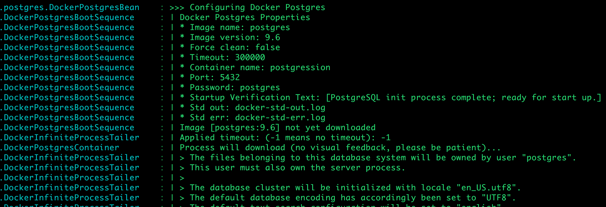
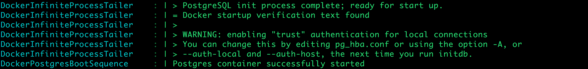
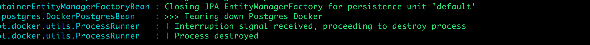

# Docker Postgres

Library for hooking Docker-based Postgres into your Spring Boot lifecycle, right before Liquibase and deleting it afterwards.

> If you develop for a particular database, your development process should reflect this.

# Introduction

If you subscribe to the above quote, this might be the library for you. Previously, when we developed applications for Postgres, we had a development pipeline based on H2, an in-memory database. The advantages of H2 are appealing; it runs at your behest and it is torn down with ease. 

However, this approach also has substantial downsides. The most important one is that you are developing to another database. This becomes most apparent at the time when the application must be deployed to its first environment and queries break down. Another disadvantages is that it is not possible to make use of the powerful features of Postgres in H2; mocking becomes a regrettable requirement. 

This library is a plug-and-play Docker Postgres enabler that hooks you into the Spring Boot lifecycle. It starts up your Postgres when you need it, and it tears it down when you are done.

# System Requirements

You must have Docker installed on your system.

## Mac OS X

If you are on Mac OS X, following these instructions: https://docs.docker.com/docker-for-mac/

*Docker for Mac* is an small wrapper which runs at low overhead on your system. It makes sure you have full Docker functionality. For those who have known boot2docker; this is the version of it that actually works.

## Linux

Follow the link for your Linux distro: https://docs.docker.com/engine/installation/linux/

## Liquibase

This library works on the assumption that you use Liquibase. This dependency is checked to determine the moment when the Docker Postgres container must be available. Liquibase creates the database schema before the rest of your application runs. It is highly recommended to use Liquibase: http://www.liquibase.org/

# Usage

## Spring Boot POM

Add the following two dependencies to your POM. This is enough to make it all work.

```xml
<dependency>
    <groupId>nl.42</groupId>
    <artifactId>spring-boot-starter-docker</artifactId>
    <version>1.0.2</version>
    <scope>provided</scope>
</dependency>

<dependency>
    <groupId>nl.42</groupId>
    <artifactId>spring-boot-docker-postgres</artifactId>
    <version>1.0.1</version>
    <scope>provided</scope>
</dependency>
```

Note that the ```provided``` scope ascertains the Docker Postgres container is available for spring-boot:run and unit tests, but will not be assembled as a lib in your WAR file.

## Arguments

You can tweak the configuration to use for your Docker run.

| argument                  | description   |
| ------------------------- | ------------- |
| container-name            | the Docker container on which the image has to run. Default: postgression |
| custom-variables          | contains a map of your own variables. These can be used to substitute values if you provide your own docker-command. No default |
| docker-command            | the docker command to use to start the container with postgres. Default: 'docker run --rm -e POSTGRES_PASSWORD=${password} -p 5432:${port} --name ${containerName} ${imageName}:${imageVersion}' |
| enabled                   | determines if the Postgres container must be started. Default: true |
| force-clean               | determines if the container must be removed if it already exists. Default: true|
| force-clean-afterwards    | when the docker processes finishes, clean up the container. Default: true|
| image-name                | the image name to be used for deploying the container. Default: postgres |
| image-version             | the version of the image to be used for deploying the container. Advice is to specify wherever possible. Default: latest |
| password                  | the password used to apply for the database on the container. Default: postgres |
| port                      | the port that you can access the database on will be taken from spring's datasource URL. |
| startup-verification-text | the text that will be searched within the Docker log. If found, the Postgres container is available. Default: "PostgreSQL init process complete; ready for start up." |
| std-out-filename          | the file to write the Docker output to. Default: "docker-std-out.log" |
| std-err-filename          | the file to write the Docker errors to. Default: docker-std-err.log |
| stop-if-container-exists          | stop the process if a container with 'container-name' exists. Default: false |
| timeout                   | the timeout to apply for booting the container. Note that the value will not be used if the image has to be downloaded. Default: 300000 (5 minutes) |

## Best practices

If you want to run ```spring-boot:run``` and unit tests at the same time, you may want to have two specific application.yml to cover for both situations.

Eg, for ```spring-boot:run```:

```yaml
docker:
  postgres:
    image-version: 9.6
```

And for your unit tests in src/test/resources:

```yaml
docker:
  postgres:
    image-version: 9.6
    force-clean: true
    container-name: postgression2
```

Be sure to point your datasource url to another port, for example 5434 (instead of 5432).

Note that the force-clean flag is useful for tests. There is no reason to keep the container in that case and you might as well remove it, when another version is found.

Since the Postgres containers will be run on different identifiers and ports, you can run them in parallel.

# Troubleshooting

There is one major caveat; the entire process hinges on a graceful shutdown of your Spring container. There are a couple of reasons when this will not occur:
* you pressed the 'stop' button in IntelliJ
* you ```kill -9``` your Spring container
* the process kills itself for whatever reason

In all of these situations, the end result is the same: the container will keep on running. 

You need to know a couple of Docker commands to help you out.

## Cleaning up the container

Show the list of containers currently running:

```
docker ps
```

Kill the container:

```
docker rm -vf postgression
```

(fill in any name other than postgression)

Show the images you have currently downloaded:

```
docker image ls
```

Delete an image (and trigger a new download on the next run):

```
docker image rm postgres
```

(fill in any name other than postgres)

Docker has a lot more in store than what we have shown here. Be sure to check it out if you want to learn more: https://docs.docker.com/

## Log files

Since Docker is run through Java's ```ProcessBuilder```, the output of the process is sent to two files. These two files are constantly removed and reused by all Docker calls and across parallel Docker processes. Be sure to understand this if you intend to do anything with the log files.

## Spring Boot log

A lot of information can be read from the Spring Boot log. The parts which pertain to Docker Postgres are prefixed with a '|' symbol. Within this group exist:
* non-prefixed; actions taken in the library
* \>; output from std out/err
* $\>; commands run with Java's ProcessBuilder

When a failure occurs, the error log will be read and logged. If the container starts up to spec, than it will be logged at warn level. If not, at error level.

If the container does not start up, the Spring Boot startup sequence will be terminated.

## Slow system?

If you have a slow system, your Spring Boot may be faster than the time when Postgres is really ready (ie, this is not the same as when Docker tells it is ready). The result is the following error:

```
Caused by: org.postgresql.util.PSQLException: FATAL: the database system is starting up
```

This can be remedied by applying a post startup verification wait time (in milliseconds) to your application:

```yaml
docker:
  postgres:
    after-verification-wait: 2000
```

In this example, it will wait for an extra 2 seconds.

# Docker Postgres in action

When docker-postgres starts, your log will show this:



After it has found the verification text, you will see this:



When the Spring Container is gracefully shutdown, you will see this:


